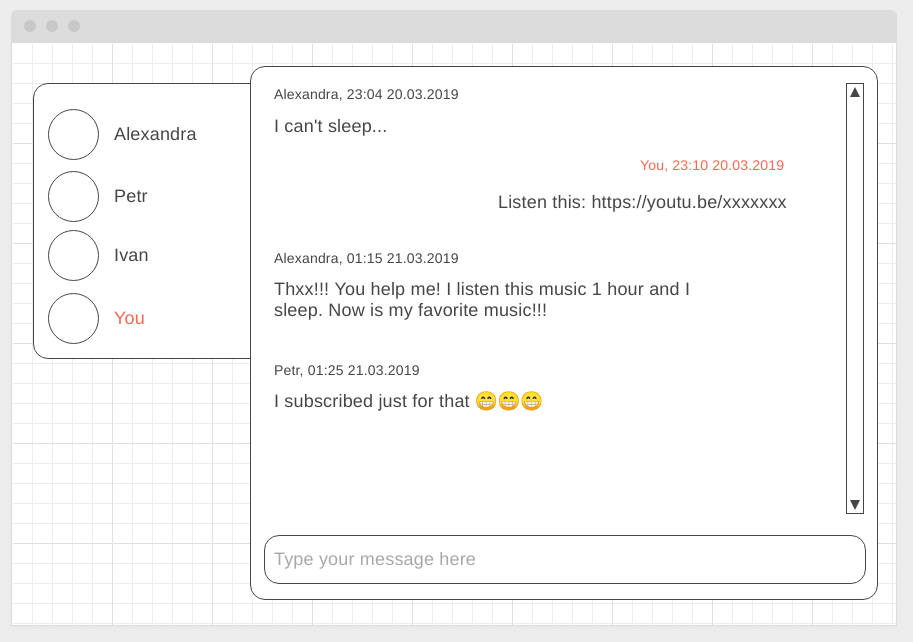

deployment: https://marinaustinovich.github.io/ahj-homeworks-sse-ws_Chat/
## Чат

### Легенда

В рамках реализации корпоративного портала вам поручили организовать чат, и вы решили для этого использовать веб-сокеты.

### Описание

Реализована и серверную, и клиентскую часть. Серверную часть - на базе пакета WS.

При загрузке страницы появляется всплывающее окно, в котором запрашивается никнейм, под ним пользователь зарегистрирован в чате:

Если такой никнейм свободен, то открывается окно чата. В противном случае сообщается пользователю, что никнейм занят и ему необходимо выбрать другой. 

Общее окно чата:

Сообщения всех участников чата, кроме ваших, выравниваются по левому краю, а ваши — по правому.

Важно: `You` — это не никнейм, а указатель на то, что это вы.

При отключении пользователя он должен удаляться из списка пользователей в левой части.
